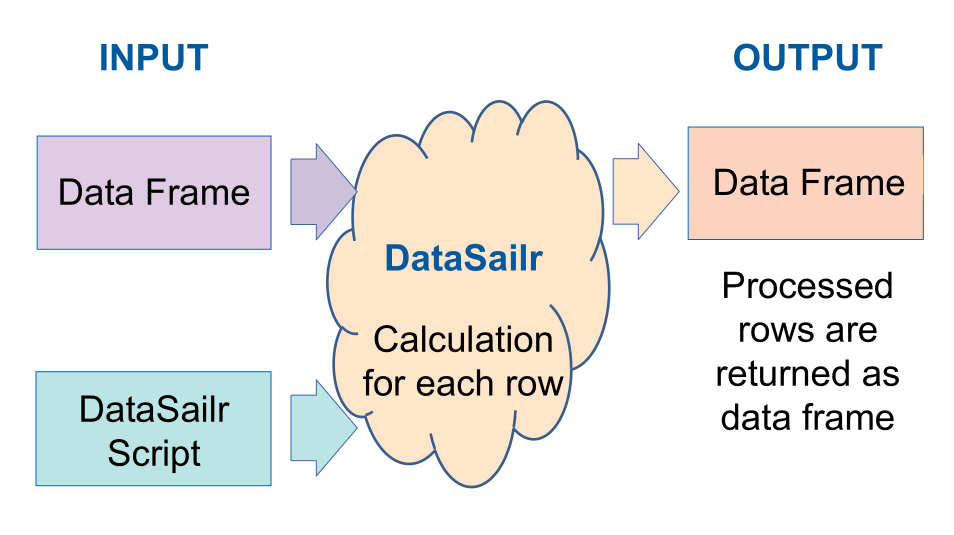

# Summary

Data processing and data cleaning are essential steps before applying statistical or machine learning procedures[@pyle1999; @garcia2015]. R provides a flexible way for data processing using vectors. Additional R packages also provide other ways for manipulating data such as using SQL and using chained functions. I present yet another way to process data in a row by row manner using data manipulation oriented script, DataSailr script. The script enables users to instruct data processing in a row wise manner, and the script is intuitive and easy to learn. This article introduces the datasailr package, and potential benefits of this row wise approach.


# Statement of Need

The [datasailr](https://CRAN.R-project.org/package=datasailr) package enables users to instruct data processing in a row wise manner using DataSailr script, which is an easy and intuitive script designed especially for data manipulation. This row by row approach is different from R's built-in functionality, which provides data processing through column vector calculations. Row wise approach does not require vectors, and can be intuitive compared to R's default column vector approach.

DataSailr script is a domain specific language for data processing. Using domain specific language for data manipulation is a similar approach to SAS^[SAS and all other SAS Institute Inc. product or service names are registered trademarks or trademarks of SAS Institute Inc. in the USA and other countries.] software[@sas1985sas:1985]. SAS software provides DATA blocks, within which users can write scripts that are specific for data manipulation in a row wise manner. The separation of data manipulation steps and statistical procedures has a benefit of improved readability. Its row wise data manipulation script is easy to understand and learn. DataSailr brings the same kind of experience to R.

There are also other R packages that have been improving data manipulation, such as sqldf[@sqldf:2017] and dplyr[@dplyr:2021]. The sqldf package enables users to write SQL for data manipulation. The dplyr package enables users to write data manipulation procedures in a sequential way by chaining functions without thinking much about column vectors. DataSailr enables the same kind of things with a single DataSailr script.


# How DataSailr Works

DataSailr has a main function called sail() function. It takes R's data frame and DataSailr script, and the data frame is processed following the script. The first argument is data frame. The second argument is DataSalr script, and each row is processed following this script as described in \autoref{fig:datasailr_workflow}.

{width=80%}


# DataSailr Script

The following example script conducts data processing for R's built-in 'mtcars' data. The example script generates description, country and manufacturer columns for each car using hp (i.e. horse power) and mpg (i.e. miles per gallon) columns and row names. The row names contain names of cars. The script uses functionality of variable assignment, if-else statements, special variables, regular expression matching, backreference and built-in functions, which are explained in [README](https://github.com/niceume/datasailr/blob/master/README.md) and [DataSailr website](https://datasailr.io).


* Example

```r
library(datasailr)
data(mtcars)

# datasailr::sail() function takes data frame for its first argument,
# and DataSailr script as character for its second argument.

result = datasailr::sail( mtcars, '
  // Comments in DataSailr start with double slashes
  // if-else statement:
  // Check if hp column value is larger than 100 or not. 
  if(hp > 100 ){
    // Variable assignment:
    // Variables in codes correspond to the columns with the same name.
    // In this case, powerful column value is set "powerful".
    powerful = "powerful "
  }else {
    // powerful column value is set empty.
    powerful = ""
  }
  
  // if-else can also be written like this
  if(mpg > 20){ efficient = "efficient" }
  else {  efficient = "" }

  // Regular expressions that match manufacturer names
  // Assigning regular expressions to variables do not affect data frame
  // , but can become reused at different lines.
  germany = re/(^Merc|^Porsche|^Volvo)/
  japan = re/(^Mazda|^Honda|^Toyota)/
  datsun = re/(^Datsun)/
  hornet = re/(^Hornet)/
  valiant = re/(^Valiant)/
  duster = re/(^Duster)/
  
  // Regular expression matching with special variable _rowname_
  if ( _rowname_ =~ germany ) {
    country = "Germany"
    // Backreference to matched strings
    // rexp_matched(1) means the first grouped sub string. 
    manufacturer = rexp_matched(1)
  }else if ( _rowname_ =~ japan ) {
    // semicolons can be used as terminals of statements
    country = "Japan"; manufacturer = rexp_matched(1)
  }else if ( _rowname_ =~ datsun ) {
    country = "Japan"; manufacturer = "Nissan"
  }else if ( _rowname_ =~ hornet ) {
    country = "USA"; manufacturer = "AMC"
  }else if ( _rowname_ =~ valiant ) {
    country = "USA"; manufacturer = "Chrysler"
  }else if ( _rowname_ =~ duster ) {
    country = "France"; manufacturer = "Renault"
  }else{
    country = ""
    manufacturer = ""
  }
  
  // built-in function str_concat()
  desc = str_concat( powerful, efficient)
' )

# show the first 10 rows of result data frame.
result2 = result[c( "hp", "mpg", "desc", "country", "manufacturer")]
print(head(result2, 10))
```

* Output

```
                   hp  mpg               desc country manufacturer
Mazda RX4         110 21.0 powerful efficient   Japan        Mazda
Mazda RX4 Wag     110 21.0 powerful efficient   Japan        Mazda
Datsun 710         93 22.8          efficient   Japan       Nissan
Hornet 4 Drive    110 21.4 powerful efficient     USA          AMC
Hornet Sportabout 175 18.7          powerful      USA          AMC
Valiant           105 18.1          powerful      USA     Chrysler
Duster 360        245 14.3          powerful   France      Renault
Merc 240D          62 24.4          efficient Germany         Merc
Merc 230           95 22.8          efficient Germany         Merc
Merc 280          123 19.2          powerful  Germany         Merc
```


# Acknowledgements

I would like to thank my children, Joichiro and Kaoruko for always giving me joy.


# References


